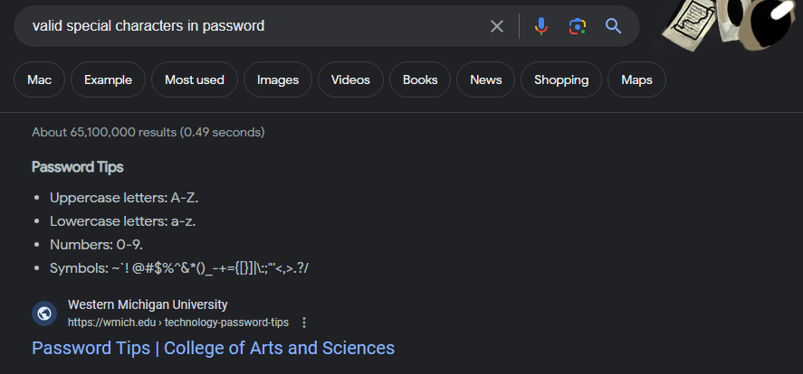

# Password-Maker

## Description

Makes passwords based on feedback by the user! I learned alot about objects as they confused me before this project. They still kida do but I feel alot better. The arrays were what mainly messed me up in the objects, but im sure i understand them now!

## Usage

Simply push the big red button (see image) and follow the promts to get your all new password

## Credits

Used to make the read me file https://courses.bootcampspot.com/courses/3906/pages/3-dot-5-3-create-a-professional-project-readme?module_item_id=885925

Valid password characters  https://wmich.edu/arts-sciences/technology-password-tips

How I found window.confirm https://stackoverflow.com/questions/45374707/javascript-mimik-window-confirm-with-keeping-boolean-returns

## License

Please refrence license file
