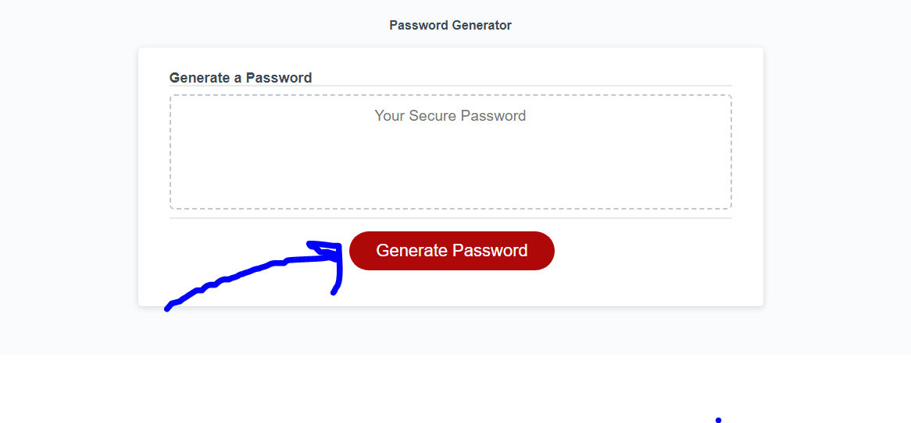

# Password-Maker

Link to live site https://jbird11801.github.io/Password-Maker/

## Description

Makes passwords based on feedback by the user! I learned alot about objects as they confused me before this project. They still kida do but I feel alot better. The arrays were what mainly messed me up in the objects, but im sure I understand them now! On lines 135 to 243 I made the program a bit more complex by adding more logic. It ensures that at least one character of the desired ones is included and randomly seeds them into the password. Since their random they could have landed on each other so I ensured they wouldn't with a while loop that I learned from a bounus question. Its extra but I feel its more secure this way and ensures that the characters you want are in the password.

## Usage

Simply push the big red button (see image) and follow the promts to get your all new password

## Credits

Used to make the read me file https://courses.bootcampspot.com/courses/3906/pages/3-dot-5-3-create-a-professional-project-readme?module_item_id=885925

Valid password characters  https://wmich.edu/arts-sciences/technology-password-tips

How I found window.confirm https://stackoverflow.com/questions/45374707/javascript-mimik-window-confirm-with-keeping-boolean-returns

## License

Please refrence license file
